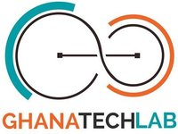
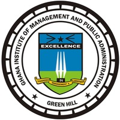
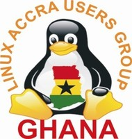

---

layout: col-sidebar
title: OWASP Ghana
tags: ghana
region: Africa
meetup-group: OWASP-Ghana-Chapter
country: Ghana
postal-code: 

---

## OWASP Ghana

Welcome to the Ghana chapter homepage. The chapter leaders are <a href="mailto://ash.dastmalchi@owasp.org">Ash Dastmalchi</a> and <a href="mailto://hassan.abudu@owasp.org">Hassan Abudu</a>. Follow chapter news on Twitter at [http://twitter.com/OWASPGhana](http://twitter.com/OWASPGhana)

 

## Participation

OWASP Foundation ([Overview
Slides](https://docs.google.com/a/owasp.org/presentation/d/10wi1EWFCPZwCpkB6qZaBNN8mR2XfQs8sLxcj9SCsP6c/edit?usp=sharing))
is a professional association of [ global
members](https://owasp.org/membership/) and is open to anyone interested in
learning more about software security. Local chapters are run
independently and guided by the
[Chapter Policy](https://owasp.org/www-policy/). As a [
501(c)(3)](https://owasp.org/about/) non-profit professional association
your support and sponsorship of any meeting venue and/or refreshments is
tax-deductible. Financial contributions should only be made online using
the authorized online chapter donation button. To be a <b>SPEAKER</b> at
ANY OWASP Chapter in the world simply review the [ speaker
agreement](https://owasp.org/www-policy/legal/speaker-agreement) and then contact the local
chapter leader with details of what OWASP PROJECT, independent research
or related software security topic you would like to present on.

 

## Supporter/Membership

 to this
chapter or become a local chapter supporter. Or consider the value of [
Individual, Corporate, or Academic Supporter
membership](https://owasp.org/membership/). Ready to become a member?

### Meeting Supporters

The following is the list of organisations who have generously provided
us with space for OWASP Ghana chapter meetings:  

<table cellpadding="10" cellspacing="0" border="0">

<tr>

<td>

</td>

<td>

</td>

<td>

</td>

<td>

</td>

</tr>

</table>

 

## Chapter Volunteers

Volunteering carries many benefits including meeting great people,
learning new skills, and above all – fun\! We appreciate the assistance
that our volunteers provide to ensure our events run smoothly. If you
would like to help out for few hours with administrative tasks on the
day of events, please reach out via email or twitter. The following is
the list of organisation(s) who have provided us volunteers:

<table cellpadding="10" cellspacing="0" border="0">

<tr>

<td>

</td>

</tr>

</table>

 

## Stay in Touch

<table cellpadding="10" cellspacing="0" border="0">

<tr>

<td>

</td>
<td>

</td>
<td>

</td>

</tr>

</table>

 

## Next Meeting/Event(s)

Chapter meetings are held several times a year, typically at a location
provided by our current facility sponsor.

Our next meeting will be online and it will take place on Saturday, February 26, 2022 from 11 AM to 1 PM Greenwich Mean Time (GMT).

Further meeting details can be found on Meetup page. Please visit [https://www.meetup.com/OWASP-Ghana-Chapter/] to view our upcoming and past meetings.



#### TICKETS:

This event will be free to attend for both members and non-members of
OWASP and is open to anyone interested in application security and cyber
security.

You can register to learn about our future events via the OWASP Ghana page at
[meetup.com](https://www.meetup.com/OWASP-Ghana-Chapter/)

**Code of Conduct**:

  -   
    We hope you enjoy our events, we care deeply about inclusivity and
    diversity so that OWASP is a comfortable and welcoming community for
    everyone. Please reach out to one of our chapter leaders if you have
    any feedback or would like to speak to us, we take these matters
    very seriously. You can find out more about our policies here:
    [https://owasp.org/www-policy/operational/events](https://owasp.org/www-policy/operational/events)

 

## Speaking at OWASP Ghana Chapter Events

#### Call For Speakers

Call For Speakers is open - if you would like to present a 15-45 minute
talk on Application / Cyber Security at future OWASP Ghana Chapter
events - please review and agree with the [OWASP Speaker
Agreement](https://owasp.org/www-policy/legal/speaker-agreement) and submit your
talk/presentation [Ghana Leaders](mailto:ghana-leaders@owasp.org)

Please note that you can also pair up with a colleague and present a
joint talk. Please ensure that your talk is objective, stresses open
source approaches, and avoids references to any commercial offerings of
your company. We are looking forward to your submissions
